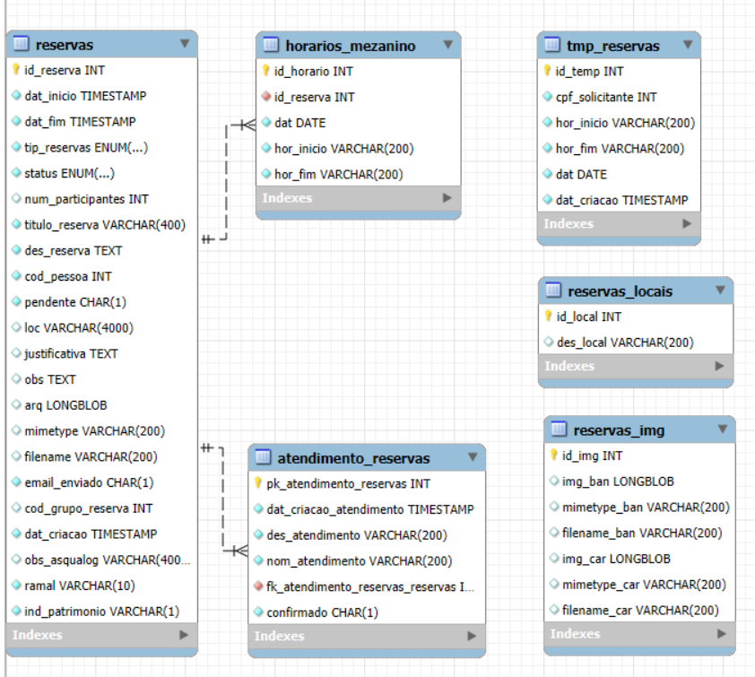

# Banco de Dados — RTMES

Este documento descreve as tabelas que compõem o banco de dados utilizado pelo RTMES.

## Visão geral

O banco de dados consiste em 5 tabelas, sendo que 2 delas possuem valores estáticos. As tabelas armazenam informações sobre reservas, horários do mezanino, histórico de atendimento das reservas e imagens/locais de referência.

## Tabelas

- **RESERVAS** — registros principais de reserva
  - `id_reserva` (NUMBER) — identificador
  - `dat_inicio` (TIMESTAMP(6)) — início do evento
  - `dat_fim` (TIMESTAMP(6)) — fim do evento
  - `tip_reservas` (VARCHAR2(20)) — tipo (porta-banner, porta-cartaz, adesivagem, mezanino)
  - `status` (VARCHAR2(20)) — estado (Em andamento, confirmado, cancelado, realizado)
  - `num_participantes` (NUMBER) — estimativa (mezanino)
  - `titulo_reserva` (VARCHAR2(400)) — título do evento/campanha
  - `des_reserva` (VARCHAR2(4000)) — descrição detalhada
  - `cod_pessoa` (NUMBER) — CPF do solicitante
  - `pendente` (VARCHAR2(1)) — índice de confirmação pelo solicitante
  - `loc` (VARCHAR2(4000)) — local (válido para totens)
  - `justificativa` (VARCHAR2(4000)) — resposta da ASQUALOG
  - `obs` (VARCHAR2(4000)) — observações do solicitante
  - `arq` (BLOB) — arquivo (identidade visual, adesivo, PDF)
  - `mimetype` (VARCHAR2(200)) — tipo do arquivo
  - `filename` (VARCHAR2(200)) — nome do arquivo
  - `email_enviado` (VARCHAR2(1)) — flag de envio de e-mail
  - `cod_grupo_reserva` (NUMBER) — agrupamento para região dinâmica
  - `dat_criacao` (TIMESTAMP(6)) — data de criação
  - `ramal` (VARCHAR2(10)) — ramal do solicitante
  - `ind_patrimonio` (VARCHAR2(1)) — flag para solicitar mudança ao patrimônio

- **HORARIOS_MEZANINO** — horários detalhados para reservas do tipo mezanino (N:1 com RESERVAS)
  - `id_horario` (NUMBER) — identificador
  - `id_reserva` (NUMBER) — FK para `RESERVAS`
  - `dat` (DATE) — data do dia da reserva
  - `hor_inicio` (VARCHAR2(200)) — hora de início
  - `hor_fim` (VARCHAR2(200)) — hora de término

- **ATENDIMENTO_RESERVAS** — auditoria / histórico de processamento das reservas (N:1 com RESERVAS)
  - `pk_atendimento_reservas` (NUMBER) — identificador do atendimento
  - `dat_criacao_atendimento` (TIMESTAMP(6)) — data/hora do registro
  - `des_atendimento` (VARCHAR2(200)) — descrição breve (ex: reserva aprovada)
  - `fk_atendimento_reservas_reservas` (NUMBER) — FK para `RESERVAS`
  - `confirmado` (CHAR(1)) — flag de confirmação

- **RESERVAS_IMG** — tabela estática com exemplos de imagens (porta-banner, porta-cartaz)
  - `id_img` (NUMBER)
  - `img_ban` (BLOB), `mimetype_ban` (VARCHAR2(200)), `filename_ban` (VARCHAR2(200))
  - `img_car` (BLOB), `mimetype_car` (VARCHAR2(200)), `filename_car` (VARCHAR2(200))
  - Observação: possui apenas uma linha; não se relaciona com outras tabelas.

- **RESERVAS_LOCAIS** — tabela estática com locais mais comuns
  - `id_local` (NUMBER)
  - `des_local` (VARCHAR2(200)) — nome do local
  - Observação: possui ~8 registros; não se relaciona com outras tabelas.

---
