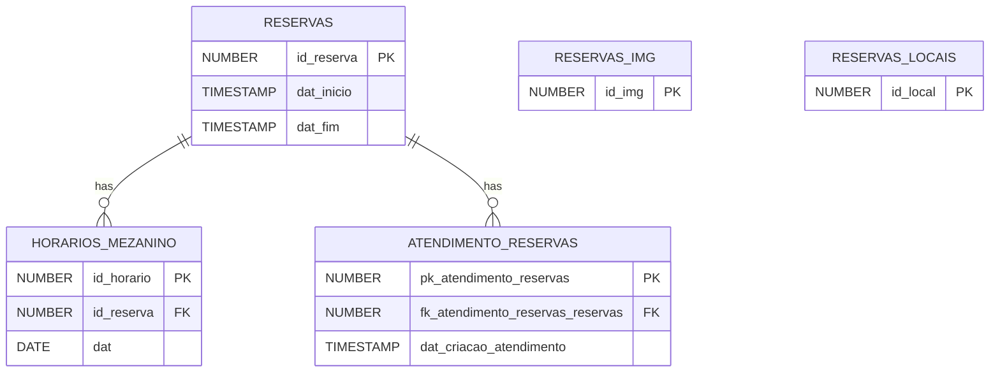

  <h1>Banco de Dados — RTMES</h1>

Este documento apresenta uma visão geral do funcionamento do banco de dados do RTMES e a modelagem física utilizada em produção. As descrições de campos, constraints e triggers estão separadas por tabela (links abaixo).

---

## 📖 Índice

- [Visão Geral](#-visão-geral)
- [Organização da documentação](#-organização-da-documentação)
- [Modelagem física](#-modelagem-física)
- [Documentação por tabela](#-documentação-por-tabela)

---

## 🔎 Visão Geral

O banco de dados do RTMES foi modelado para suportar reservas com diferentes granularidades (totens e adesivagem por dias inteiros; mezanino por intervals de horário), auditoria de atendimento e tabelas auxiliares estáticas para imagens e locais comuns.

As decisões principais de modelagem foram:

- Separar horários do mezanino em uma tabela `HORARIOS_MEZANINO` com relação N:1 para permitir múltiplos intervalos por reserva.
- Manter histórico/auditoria em `ATENDIMENTO_RESERVAS` para rastreabilidade do fluxo de aprovação.
- Armazenar conteúdos binários (identidade visual, imagens) em colunas BLOB nas tabelas apropriadas.

## 🗂️ Organização da documentação

Cada tabela possui sua própria pasta em `docs/banco_de_dados/` com um `README.md` contendo:

- Descrição funcional da tabela
- Lista de campos e suas descrições (tipos, constraints)
- Constraints, índices e triggers existentes
- Exemplos de consultas ou rotinas relacionadas

Use os links abaixo para navegar até a documentação por tabela.

## 🗺️ Modelagem física

O diagrama físico do banco de dados mostra tabelas, chaves primárias e relacionamentos usados em produção. Utilize o diagrama para entender cardinalidades, dependências e caminhos de consulta.

  

*Arquivo: `docs/banco_de_dados/BD_Físico.png`.*

## 🔗 Documentação por tabela

- [RESERVAS](reservas/README.md)
- [HORARIOS_MEZANINO](horarios_mezanino/README.md)
- [ATENDIMENTO_RESERVAS](atendimento_reservas/README.md)
- [RESERVAS_IMG](reservas_img/README.md)
- [RESERVAS_LOCAIS](reservas_locais/README.md)

## 🧭 ERD (Mermaid)

---